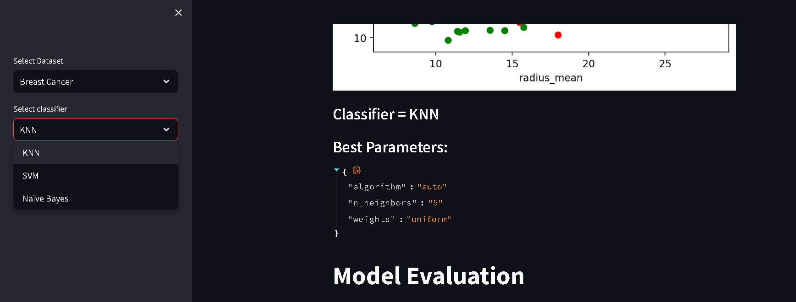

# Exploration of classifiers for dataset with streamlit
## Streamlit Interface
### Main Page

### Correlation Matrix

### Scatter Plot

### Best Parameters(GridSearchCV)

### Model Evaluation

## Library requirements:
* streamlit
* numpy
* matplotlib
* pandas
* seaborn
* scikit-learn (sklearn)
* plotly.express (plotly)
## Implementation:
After running app.py and main py, just run this command on your terminal:
streamlit run [main.py file path]

[def]: "C:\Users\user\Desktop\streamlit_ml_classifier_meter\image\interface.png"